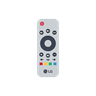
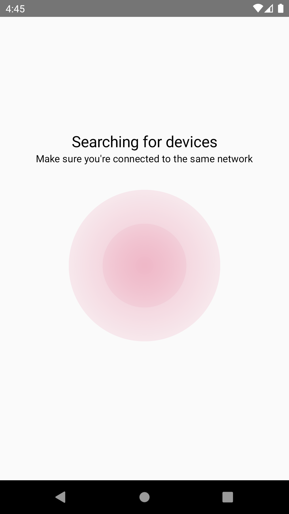
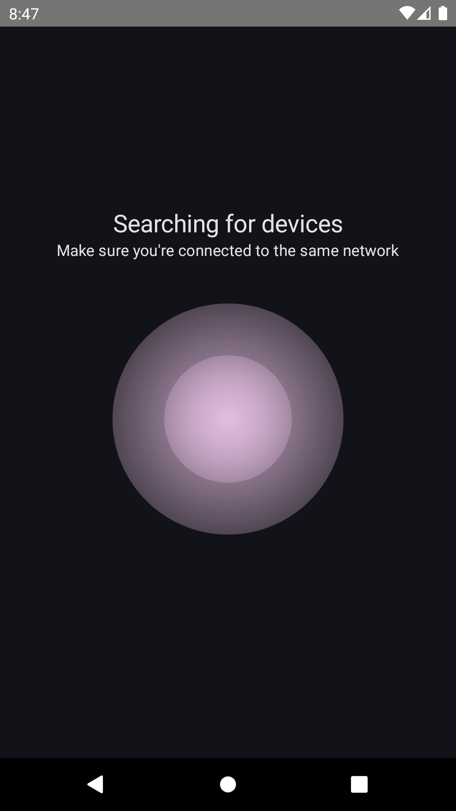
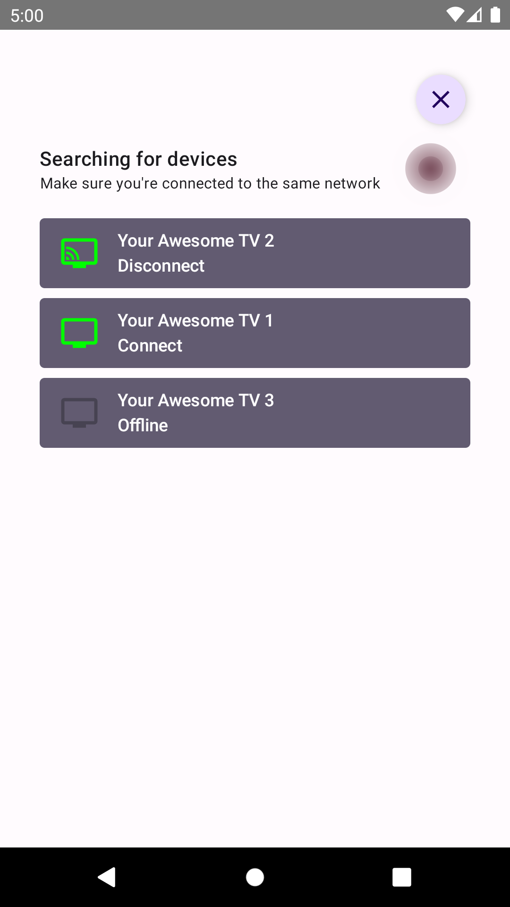
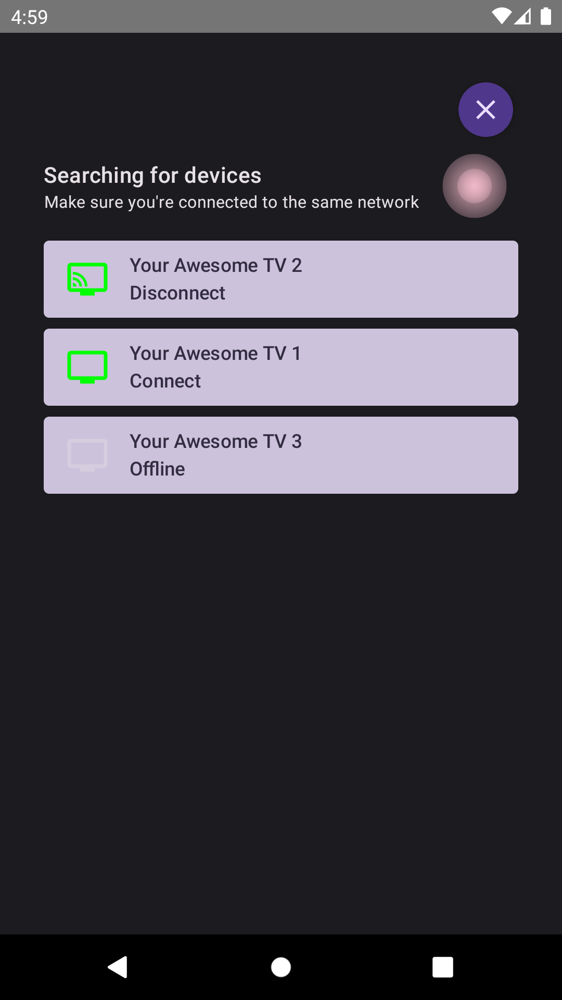
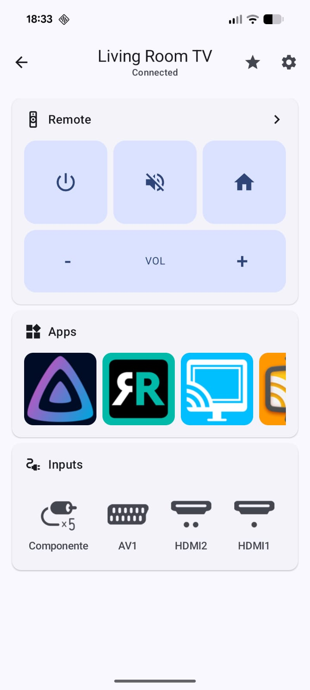
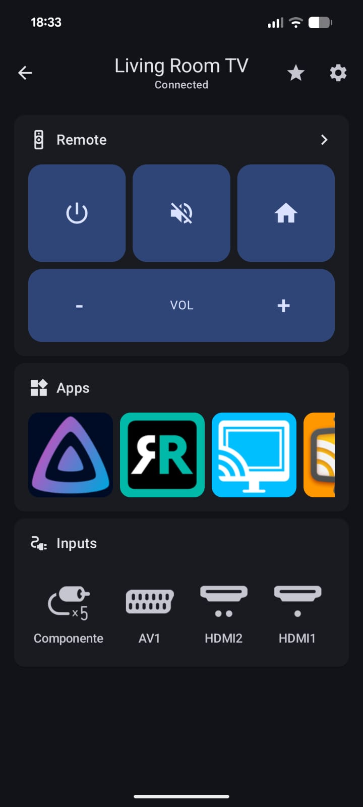
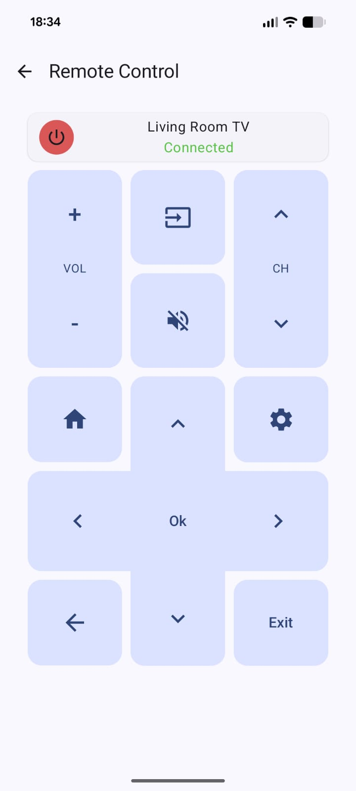
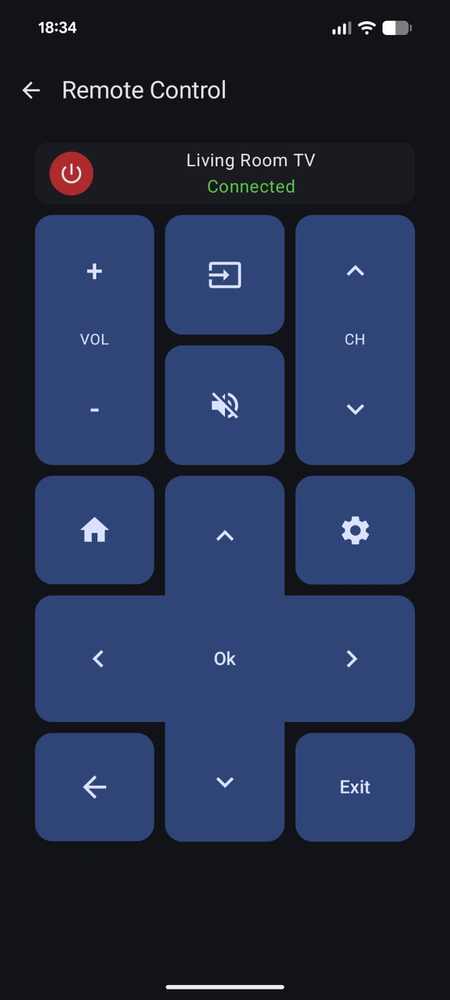

## LG TV Controller

An ad free android app to control your LG television.

I started this project because the only apps I could find to control my tv were full of ads and 
therefore unusable, so I decided to make an add free one that I could use without stress.

### Contents

* [Current UI](#current-ui)
  * [Device Searching](#device-searching)
  * [Device list](#device-list)
  * [Device Home](#device-home)
  * [Device Controller](#device-controller)

### Current UI

#### Device Searching

Light Theme                |  Dark Theme
:-------------------------:|:-------------------------:
  |  

#### Device list

Light Theme                |  Dark Theme
:-------------------------:|:-------------------------:
  |  

#### Device Home

Light Theme                |  Dark Theme
:-------------------------:|:-------------------------:
  |  

#### Device Controller

Light Theme                |  Dark Theme
:-------------------------:|:-------------------------:
  |  
